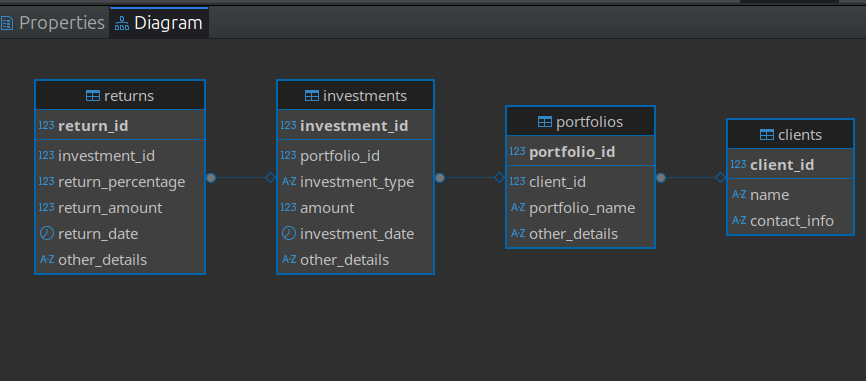

# Investment Portfolio Management System

A relational database project built in PostgreSQL, modelling how a financial services firm tracks clients, their investment portfolios, individual investments, and the returns those investments generate over time.

The project covers the full lifecycle of a database solution: schema design, data population, and a structured set of SQL queries — from simple retrieval through to multi-table joins, aggregation, and correlated subqueries.

## Overview

- **Database:** PostgreSQL, hosted on [Supabase](https://supabase.com)
- **Client:** [DBeaver Community Edition](https://dbeaver.io)
- **Data:** 10 clients, 11 portfolios, 11 investments, 10 returns (Botswana context, values in BWP)
- **Queries:** 15 total — 5 basic, 5 intermediate, 5 advanced

## Entity-Relationship Diagram



*(Add your exported ER diagram image to a `docs/` folder in this repo, and update the path above if needed.)*

## Schema

Four tables, linked in a one-to-many chain: a client can hold multiple portfolios, a portfolio can hold multiple investments, and an investment can generate multiple returns.

```sql
CREATE TABLE clients (
    client_id     SERIAL PRIMARY KEY,
    name          VARCHAR(100) NOT NULL,
    contact_info  VARCHAR(255)
);

CREATE TABLE portfolios (
    portfolio_id    SERIAL PRIMARY KEY,
    client_id       INT REFERENCES clients(client_id),
    portfolio_name  VARCHAR(100) NOT NULL,
    other_details   VARCHAR(255)
);

CREATE TABLE investments (
    investment_id     SERIAL PRIMARY KEY,
    portfolio_id      INT REFERENCES portfolios(portfolio_id),
    investment_type   VARCHAR(100) NOT NULL,
    amount            DECIMAL(12, 2) NOT NULL,
    investment_date   DATE,
    other_details     VARCHAR(255)
);

CREATE TABLE returns (
    return_id          SERIAL PRIMARY KEY,
    investment_id      INT REFERENCES investments(investment_id),
    return_percentage  DECIMAL(5, 2) NOT NULL,
    return_amount       DECIMAL(12, 2) NOT NULL,
    return_date         DATE,
    other_details        VARCHAR(255)
);
```

Full schema and sample data: [`investment_portfolio_schema.sql`](investment_portfolio_schema.sql)

## Data

Sample data reflecting a Botswana-based client base is loaded as part of [`investment_portfolio_schema.sql`](investment_portfolio_schema.sql), directly after the table definitions.

## Queries

All 15 queries live in [`investment_portfolio_queries.sql`](investment_portfolio_queries.sql), grouped by difficulty.

**Basic** - single/two-table lookups and aggregation
- Retrieve all client names and contact information
- Retrieve all portfolio names with their client names
- Retrieve total investment amount per portfolio
- Retrieve investments of a specific type
- Retrieve average return percentage per investment type

**Intermediate** -full-chain joins, ranking, comparisons
- Retrieve total return amount per investment type, with portfolio and client info
- Retrieve the top 5 portfolios by total investment amount
- Retrieve investments made in the past year
- Retrieve clients holding investments in multiple portfolios
- Retrieve portfolios with total returns above the overall average

**Advanced** - correlated subqueries and anti-joins
- Retrieve the top 3 clients by total investment amount
- Retrieve portfolios with the highest average return percentage
- Retrieve investments that have not yet received any returns (LEFT JOIN anti-join)
- Retrieve clients whose every portfolio has at least one investment
- Retrieve the single highest-value portfolio per client (correlated subquery)

## Setup

1. Create a free PostgreSQL database on [Supabase](https://supabase.com).
2. Connect to it using [DBeaver](https://dbeaver.io) (or any PostgreSQL client).
3. Run the scripts in order:
   ```
   investment_portfolio_schema.sql   -- creates the four tables and loads sample data
   investment_portfolio_queries.sql  -- run individually to explore the data
   ```

## Skills Demonstrated

- Relational schema design and normalisation
- Primary and foreign key constraints for referential integrity
- Multi-table joins (INNER JOIN, LEFT JOIN)
- Aggregation with SUM, AVG, COUNT, GROUP BY, and HAVING
- Correlated and non-correlated subqueries
- Working with a live, cloud-hosted relational database

## Author

**Katlego Kgakgamatso**
[LinkedIn](https://linkedin.com/in/katlego-kgakgamatso-440894260) · [GitHub](https://github.com/Katlego-k365) · [Portfolio](https://katlego-k365.github.io)
